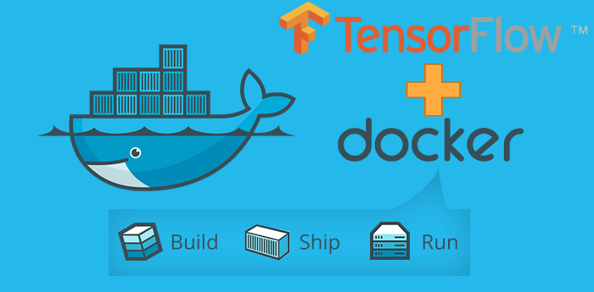
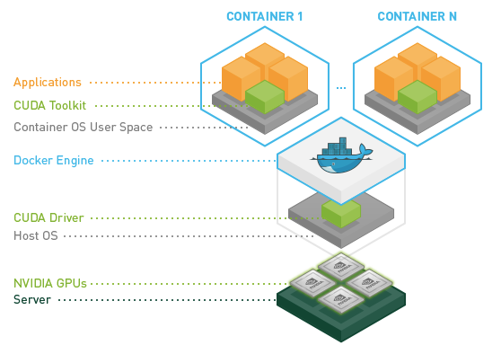

# docker-with-tensorflow







once u download the docker file .....run the command to test it 
```
docker run hello-world
```

also you can see the version by the command 
```
docker --version
```

```
# docker help 
docker
docker --help
docker <command-name> --help

# check docker version
docker --version

# check additional docker information
docker version
docker info

# check docker installation
docker run hello-world
```


`docker create` creates a container but does not start it.
`docker rename` allows the container to be renamed.
`docker run` creates and starts a container in one operation.
`docker rm` deletes a container.
`docker update` updates a container's resource limits.


`$ docker run busybox echo "hello from busybox"` 
hello from busybox


----------------

The `docker ps` command shows you all containers that are currently running.